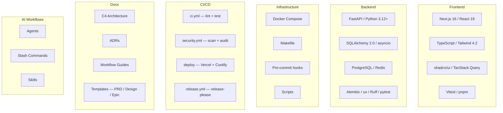
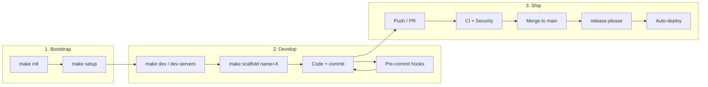
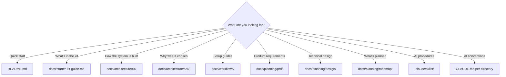

# Plan: Starter Kit Guide — visual overview + workflow reference

## Context

The starter kit contains a lot: frontend, backend, infra, CI/CD, docs, 11 AI agents, 19 commands, 9 skills. Everything is well-organized but spread across dozens of files. There's no "what's in it and how to use it" overview — something that gives the full picture in 30 seconds.

**Goal:** One document that visually inventories the kit and shows key workflows. Primarily as own workflow reference, secondarily useful for team/new developers.

## Approach

One new markdown file (`docs/starter-kit-guide.md`) with Mermaid diagrams. No extra tooling, renders natively on GitHub. Two small edits to link to it.

Alternatives considered:
- ~~Enhanced README.md~~ — README is well-balanced now (quick start + links). Stuffing inventory in makes it 300+ lines
- ~~Interactive HTML~~ — Maintenance overhead, breaks "everything is markdown" convention
- ~~Docs site~~ — Overkill for the problem

## Changes

### 1. New: `docs/starter-kit-guide.md` (~250 lines)

All content in English (consistent with existing docs). Six sections:

#### Section 1: "What's in the Box" — Component Map

Mermaid `graph TD` with subgraphs. No hardcoded counts in the diagram (avoids staleness). Categories: Frontend, Backend, Infrastructure, CI/CD, Docs, AI Workflows.



#### Section 2: Project Lifecycle Flow

Mermaid `flowchart LR` — three phases: Bootstrap → Develop → Ship. Exact `make` commands per step.



#### Section 3: Makefile Quick Reference (table)

| Command | When | What it does |
|---|---|---|
| `make help` | Anytime | Show all available commands |
| `make init` | Once, after clone | Rename project, reset git, regenerate lockfiles |
| `make setup` | Once, after init | Install deps (pnpm + uv), configure pre-commit hooks |
| `make dev` | Daily | Start Docker (postgres/redis), run migrations, print server commands |
| `make dev-servers` | Daily (alternative) | Find free ports, start both servers automatically |
| `make dev-stop` | End of session | Stop servers started by current session |
| `make test` | Before commit/PR | Backend (pytest) + frontend (vitest) |
| `make lint` | Before commit/PR | Backend (ruff) + frontend (eslint) |
| `make scaffold name=X` | New feature | Generate feature skeleton (backend + frontend) |
| `make sync-upstream` | Periodically | Pull infrastructure updates from starter-kit |
| `make sync-upstream-dry` | Before sync | Preview what would change |
| `make sync-upstream-init` | Once | One-time setup for starter-kit syncing |

#### Section 4: AI Workflows Catalog

Detailed catalog grouped by purpose. `docs/README.md` already has a brief pointer to `.claude/`; this section provides the full reference.

**Agents** (`.claude/agents/`) — grouped by role:

| Agent | Purpose |
|---|---|
| code-architect | System design and architecture decisions |
| staff-engineer | Senior review: correctness, performance, security |
| code-simplifier | Reduce complexity |
| build-validator | Verify build passes after changes |
| verify-app / integration-verifier | End-to-end and cross-boundary verification |
| prd-product/technical/risk-reviewer | PRD review from 3 perspectives |
| linkedin-style-editor | Content editing for LinkedIn posts |
| oncall-guide | Incident response guidance |

**Key Slash Commands** — grouped by workflow:

| Workflow | Commands |
|---|---|
| Planning | `/pre-plan-prompt`, `/plan-and-review` |
| Features | `/feature`, `make scaffold` |
| Quality | `/staff-engineer`, `/preflight-check`, `/verify-app`, `/verify-acceptance`, `/verify-integration` |
| PRD | `/prd` (7-question interview → reviewed PRD) |
| Code | `/refactor`, `/code-architect`, `/code-simplifier` |
| Ops | `/debug`, `/oncall-guide`, `/build-validator` |
| Docs | `/doc-check`, `/arch-check` |

**Skills** (`.claude/skills/`) — complex multi-step workflows:

| Skill | Purpose |
|---|---|
| plan-review-workflow | Plan + iterative staff-engineer review |
| prd-workflow | Interview → draft → 3-agent review → approval |
| staff-engineer-review | Deep architecture and code review |
| skill-creator | Meta-skill: create new skills |
| design-system / website-to-design-system | Extract or create design system |
| ui-component-creator | Generate shadcn/ui components |
| front-end-design / mobile-friendly-design | Frontend design patterns |

#### Section 5: Documentation Map

Mermaid `flowchart TD` — decision tree: "What are you looking for?" → right doc.



#### Section 6: Common Workflows (brief, with links)

4 workflows, max 3 lines each with exact steps and link to detail doc:

1. **Start a new project** — `make init` → `make setup` → follow Bootstrap Checklist in [`docs/README.md`](README.md)
2. **Add a feature** — `make scaffold name=things` or `/feature` for AI-guided → reference: `features/items/`
3. **Activate CI/CD** — Works out-of-the-box for CI + security + release. Deploy setup: [`docs/workflows/cicd-setup.md`](workflows/cicd-setup.md)
4. **Stay in sync with starter-kit** — `make sync-upstream-init` (once) → `make sync-upstream` (periodically). Details: [`docs/workflows/upstream-sync.md`](workflows/upstream-sync.md)

### 2. Edit: `README.md` (1 line added)

Under `## Documentation`, as first bullet:

```markdown
- [Starter Kit Guide](docs/starter-kit-guide.md) — What's in the box + how to use it
```

### 3. Edit: `docs/README.md` (admonition added)

After the title, before "## How documentation works":

```markdown
> [!NOTE]
> **New here?** Start with the [Starter Kit Guide](starter-kit-guide.md) for a visual overview of everything in this kit.
```

## Files

| File | Change |
|---|---|
| `docs/starter-kit-guide.md` | **New** — complete overview (~250 lines) |
| `README.md` | 1 link added in Documentation section |
| `docs/README.md` | Admonition added at top |

## Design decisions

- **`graph TD` with subgraphs** instead of `block-beta` — wider GitHub Mermaid support
- **No hardcoded counts in Mermaid diagrams** — avoids staleness when agents/commands/ADRs are added
- **Categories, not individual files** — lower maintenance
- **English** — consistent with all existing docs
- **No duplication** — each section visualizes or links, never copies existing content
- **Detailed catalog in Section 4** complements (not duplicates) the brief `.claude/` pointer in `docs/README.md`

## Staff Engineer Review — iteration 1

**Verdict: APPROVED WITH CHANGES** — all feedback addressed:

| Feedback | Resolution |
|---|---|
| Command count was 21, actual is 19 | Fixed; counts removed from Mermaid diagrams entirely |
| Hardcoded counts will go stale | Removed all counts from Mermaid nodes |
| Language inconsistency (plan says English, showed Dutch) | All content now in English |
| Missing verify-acceptance/integration/loop commands | Added to Quality workflow row |
| Missing linkedin-style-editor agent | Added to agents table |
| Missing `make help` | Added as first row in Makefile reference |
| `>` callout vs `> [!NOTE]` admonition | Changed to `> [!NOTE]` for better GitHub rendering |
| ~200 lines may be closer to 250 | Updated estimate to ~250 lines |

## Verification

1. Mermaid syntax: open `docs/starter-kit-guide.md` on GitHub → diagrams must render
2. Click all links in the document → must point to existing files
3. `README.md` and `docs/README.md` links point to the new file
