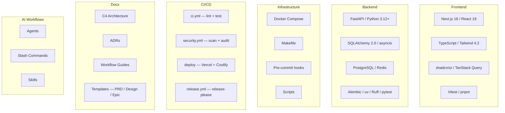
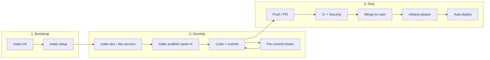
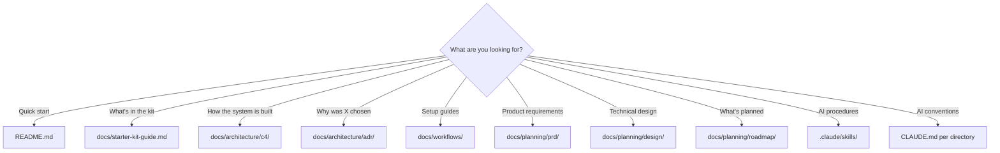

# Starter Kit Guide

Visual overview and workflow reference for the full-stack starter kit.

## What's in the Box

## Project Lifecycle

## Makefile Quick Reference

| Command | When | What it does |
|---|---|---|
| `make help` | Anytime | Show all available commands |
| `make init` | Once, after clone | Rename project, reset git, regenerate lockfiles |
| `make setup` | Once, after init | Install deps (pnpm + uv), configure pre-commit hooks |
| `make dev` | Daily | Start Docker (postgres/redis), run migrations, print server commands |
| `make dev-servers` | Daily (alternative) | Find free ports, start both servers automatically |
| `make dev-stop` | End of session | Stop servers started by current session |
| `make test` | Before commit/PR | Backend (pytest) + frontend (vitest) |
| `make lint` | Before commit/PR | Backend (ruff) + frontend (eslint) |
| `make scaffold name=X` | New feature | Generate feature skeleton (backend + frontend) |
| `make sync-upstream` | Periodically | Pull infrastructure updates from starter-kit |
| `make sync-upstream-dry` | Before sync | Preview what would change |
| `make sync-upstream-init` | Once | One-time setup for starter-kit syncing |

## AI Workflows Catalog

### Agents (`.claude/agents/`)

| Agent | Purpose |
|---|---|
| code-architect | System design and architecture decisions |
| staff-engineer | Senior review: correctness, performance, security |
| code-simplifier | Reduce complexity |
| build-validator | Verify build passes after changes |
| verify-app | End-to-end application verification |
| integration-verifier | Cross-boundary integration verification |
| prd-product-reviewer | PRD review — product perspective |
| prd-technical-reviewer | PRD review — technical feasibility |
| prd-risk-analyst | PRD review — risks and assumptions |
| linkedin-style-editor | Content editing for LinkedIn posts |
| oncall-guide | Incident response guidance |

### Slash Commands (`.claude/commands/`)

| Workflow | Commands |
|---|---|
| Planning | `/pre-plan-prompt`, `/plan-and-review` |
| Features | `/feature`, `make scaffold` |
| Quality | `/staff-engineer`, `/preflight-check`, `/verify-app`, `/verify-acceptance`, `/verify-integration`, `/verify-loop` |
| PRD | `/prd` (7-question interview → reviewed PRD) |
| Code | `/refactor`, `/code-architect`, `/code-simplifier` |
| Ops | `/debug`, `/oncall-guide`, `/build-validator` |
| Docs | `/doc-check`, `/arch-check`, `/linkedin-review` |

### Skills (`.claude/skills/`)

| Skill | Purpose |
|---|---|
| plan-review-workflow | Plan + iterative staff-engineer review |
| prd-workflow | Interview → draft → 3-agent review → approval |
| staff-engineer-review | Deep architecture and code review |
| skill-creator | Meta-skill: create new skills |
| design-system | Extract or create design system |
| website-to-design-system | Generate design system from website URL |
| ui-component-creator | Generate shadcn/ui components |
| front-end-design | Frontend design patterns |
| mobile-friendly-design | Responsive web design patterns |

## Documentation Map

## Common Workflows

1. **Start a new project** — `make init` → `make setup` → follow Bootstrap Checklist in [`docs/README.md`](README.md)
2. **Add a feature** — `make scaffold name=things` or `/feature` for AI-guided → reference: `features/items/`
3. **Activate CI/CD** — Works out-of-the-box for CI + security + release. Deploy setup: [`docs/workflows/cicd-setup.md`](workflows/cicd-setup.md)
4. **Stay in sync with starter-kit** — `make sync-upstream-init` (once) → `make sync-upstream` (periodically). Details: [`docs/workflows/upstream-sync.md`](workflows/upstream-sync.md)
